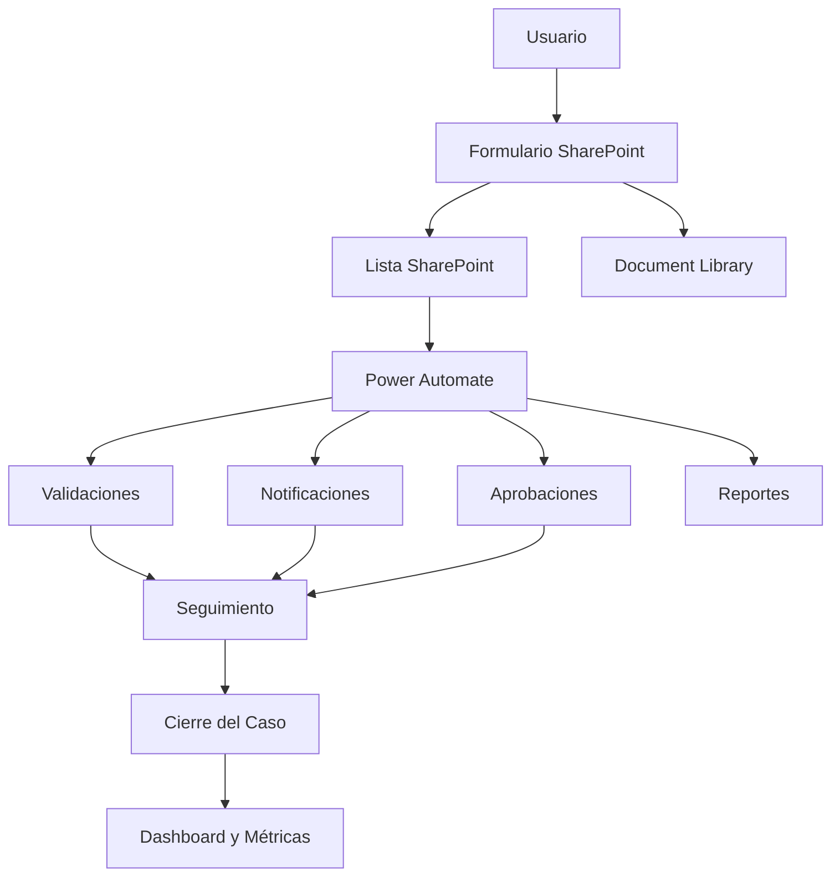
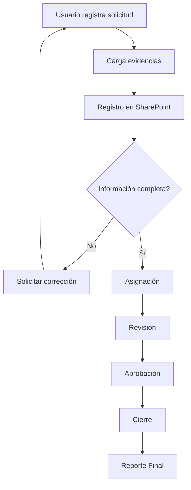
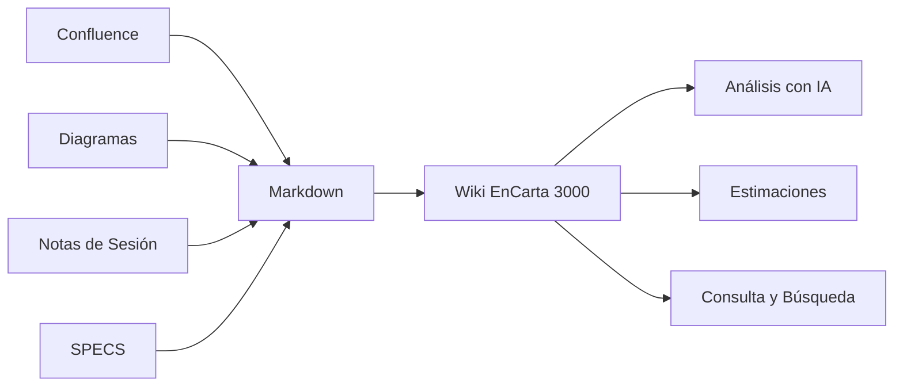
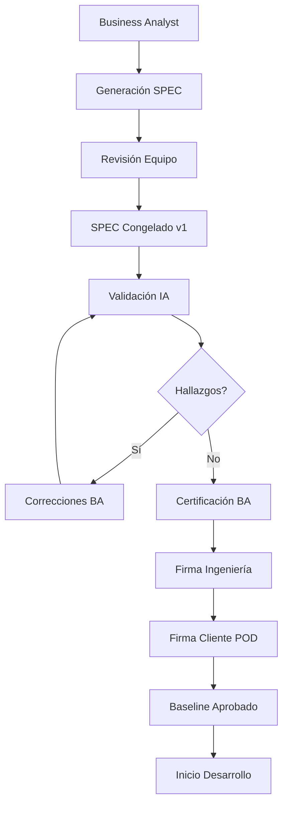
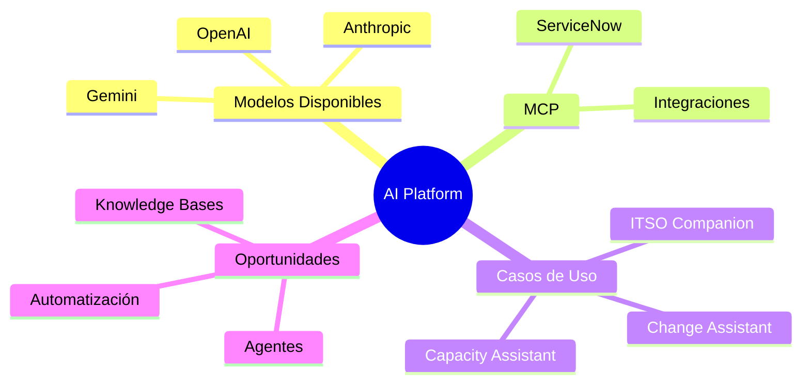

# Plan de Trabajo – Ana María Rangel
## Fecha Objetivo: Esta Semana

# Objetivo General

Ana María,

Durante esta semana me gustaría que lideraras y coordinaras varias iniciativas clave para el equipo. El objetivo de este plan no es únicamente dar seguimiento a actividades, sino ayudarte a tomar un rol cada vez más activo como punto de conexión entre negocio, análisis funcional e ingeniería.

Espero que en cada uno de los temas puedas organizar, coordinar, documentar y proponer soluciones, apoyándote en Evelyn, José Armando, Gustavo y el resto del equipo cuando sea necesario.

Las prioridades principales para esta semana son:

1. Impulsar la definición y construcción del MVP del Sistema de Tickets.
2. Liderar la organización de conocimiento para LEAP y CAN.
3. Ayudar a formalizar el proceso de gobierno y calidad de SPECS.
4. Dar seguimiento al cierre de LEAP Inversiones.
5. Continuar fortaleciendo el conocimiento del equipo sobre AI Platform.

---

# Checklist General

| Actividad | Prioridad | Estado |
|------------|------------|---------|
| Evaluar alternativa SharePoint + Power Automate para Sistema de Tickets | Alta | Pendiente |
| Estimar Run Cost PowerApps | Baja | Pendiente |
| Diseñar formulario inicial basado en SPEC | Alta | Pendiente |
| Construir repositorio de conocimiento LEAP/CAN | Alta | Pendiente |
| Convertir documentación a Markdown/Wiki | Alta | Pendiente |
| Validar cierre de SPECS de Inversiones | Alta | Pendiente |
| Definir proceso formal de aprobación de SPECS | Muy Alta | Pendiente |
| Preparar sesión de AI Platform para el equipo | Media | Pendiente |

---

# 1. Sistema de Tickets

## Contexto

Actualmente el equipo requiere una solución que permita registrar solicitudes, almacenar evidencias, dar seguimiento, generar aprobaciones y mantener trazabilidad de punta a punta. Se busca validar una alternativa basada en SharePoint y Power Automate que permita acelerar la implementación y reducir costos respecto a una solución completamente desarrollada en PowerApps.

Ana María,

En este punto me gustaría que lideraras la exploración de la solución y que nos ayudes a aterrizar una primera versión funcional. No estamos buscando la solución perfecta, sino una prueba inicial que nos permita validar rápidamente si SharePoint puede convertirse en la base de nuestro MVP.

## Objetivo

Determinar la arquitectura más rápida, económica y viable para construir un MVP funcional.

## Alcance de la Semana

### Paso 1 – Construcción del Formulario SharePoint

El objetivo principal de esta semana es construir una primera prueba funcional utilizando únicamente las capacidades nativas de SharePoint.

Ana María, espero que lideres esta actividad y que desarrolles una primera versión funcional del formulario.

Para ello te propongo:

- Gestionar o solicitar los accesos necesarios a SharePoint.
- Tomar como base la especificación ya trabajada por el equipo.
- Construir un primer formulario funcional en SharePoint.
- Incorporar todos los campos identificados actualmente en la definición funcional.
- Identificar campos obligatorios y opcionales.
- Validar que el formulario permita capturar toda la información necesaria para iniciar el proceso.

Resultado esperado:

Contar con un formulario funcional en SharePoint listo para pruebas internas.

### Paso 2 – Definición del Flujo Operativo

Una vez que tengas el formulario, me gustaría que nos ayudaras a visualizar el proceso completo de punta a punta.

Trabajar en conjunto con Evelyn para documentar visualmente el proceso completo.

Se espera generar un diagrama que permita identificar:

- Estados del ticket.
- Validaciones requeridas.
- Aprobaciones.
- Notificaciones.
- Asignaciones.
- Criterios de cierre.

Resultado esperado:

Contar con un flujo operativo documentado que sirva como base para evaluar automatizaciones futuras.

### Paso 3 – Evaluación de Automatizaciones

Ana María, en esta etapa el objetivo no es desarrollar automatizaciones complejas. Lo que busco es que identifiques oportunidades sencillas que nos permitan ganar eficiencia sin incrementar costos.

Una vez definido el flujo, evaluar qué actividades pueden resolverse mediante Power Automate utilizando las capacidades actualmente disponibles.

El objetivo en esta etapa no es construir automatizaciones complejas, sino identificar oportunidades simples para:

- Notificaciones.
- Seguimiento.
- Recordatorios.
- Asignaciones.

La prioridad actual es validar SharePoint como plataforma base del MVP.

## Diagrama de Referencia – Arquitectura Objetivo (MVP)

## Diagrama de Referencia – Flujo Operativo

## Resultado Esperado

- Recomendación técnica.
- Prototipo inicial.
- Formulario preliminar.
- Lista de campos requeridos.
- Validación de viabilidad técnica.
- Estimación preliminar de costos.

---

# 2. LEAP / CAN – Knowledge Base

## Contexto

Durante las próximas semanas continuarán realizándose sesiones de trabajo relacionadas con LEAP y CAN.

Actualmente gran parte de la información se encuentra distribuida entre grabaciones, Confluence, notas de sesión y documentación generada por los distintos participantes.

Todavía no existe una colección formal de SPECS consolidada para esta iniciativa, por lo que el foco inicial será capturar y organizar el conocimiento que se está generando en tiempo real.

Ana María,

Este punto es particularmente importante porque necesitamos comenzar a construir una memoria institucional del proyecto. Me gustaría que lideraras esta iniciativa y que te conviertas en nuestro punto focal para la organización del conocimiento.

## Objetivo

Construir una primera versión de una base de conocimiento centralizada denominada **EnCarta 3000**.

## Alcance de la Semana

Ana María, me gustaría que coordinaras esta actividad trabajando en conjunto con:

- Evelyn
- José Armando
- Gustavo

para definir el proceso operativo de captura de conocimiento.

Las actividades prioritarias serán:

- Obtener grabaciones de sesiones.
- Generar transcripciones cuando sea necesario.
- Extraer acuerdos, decisiones y definiciones relevantes.
- Organizar el contenido en formato Markdown.
- Publicar la información dentro de la estructura de Wiki.
- Preparar información útil para futuras estimaciones y análisis.

Espero que lideres esta iniciativa y que nos ayudes a definir una forma sostenible de capturar, organizar y reutilizar el conocimiento generado durante las sesiones.

## Diagrama de Referencia – Gestión del Conocimiento

## Resultado Esperado

Una primera versión navegable y organizada del repositorio de conocimiento.

---

# 3. Validación y Cierre de SPECS de LEAP Inversiones

## Contexto

La evaluación técnica de LEAP Inversiones ya fue compartida con el equipo y requiere una validación final para asegurar que todas las observaciones hayan sido revisadas e incorporadas.

Ana María,

Aquí me gustaría que nos ayudaras a coordinar el cierre formal de esta revisión para evitar que existan observaciones abiertas o interpretaciones distintas entre negocio e ingeniería.

## Objetivo

Validar y cerrar formalmente la evaluación técnica y funcional enviada previamente para LEAP Inversiones.

El objetivo es asegurar que las observaciones identificadas por ingeniería hayan sido revisadas, discutidas e incorporadas antes de continuar con nuevas fases del proyecto.

## Actividades Esperadas

- Revisar la evaluación técnica enviada.
- Validar comentarios pendientes.
- Confirmar acuerdos con Evelyn.
- Identificar puntos abiertos.
- Preparar versión final para cierre.

---

# 4. Gobierno Formal de SPECS

## Contexto

Actualmente existe riesgo de interpretaciones diferentes sobre un mismo requerimiento. Se busca establecer un proceso formal de gobierno que garantice trazabilidad, control de cambios y aprobaciones formales.

Ana María,

Este probablemente sea uno de los entregables más importantes del plan. Me gustaría que nos ayudaras a construir una propuesta inicial de gobierno que posteriormente podamos revisar y formalizar como estándar del equipo.

## Diagrama de Referencia – Proceso Objetivo

## Objetivo de Gobierno

Establecer un proceso estándar para la generación, validación, aprobación y control de cambios de SPECS utilizando prácticas de Spec Driven Design.

El objetivo es que este proceso pueda convertirse en una referencia oficial para futuros proyectos del equipo.

## Roles Esperados

### Business Analyst (Evelyn)

Responsable de:

- Liderar la definición funcional.
- Gestionar requerimientos.
- Consolidar observaciones.
- Certificar el contenido funcional.

### Ana María

- Coordinar la construcción y seguimiento del SPEC.
- Mantener la trazabilidad documental.
- Facilitar revisiones entre las distintas áreas.
- Asegurar que la información permanezca actualizada.
- Servir como enlace entre negocio, análisis e ingeniería.
- Impulsar la adopción del proceso definido.

### Ingeniería

Responsable de:

- Validar factibilidad técnica.
- Confirmar entendimiento.
- Aprobar implementación.

## Resultado Esperado

Generar una primera versión formal del Gobierno de SPECS.

Esta versión deberá:

- Documentarse en Confluence.
- Incorporar apoyo de IA para validación de calidad.
- Definir responsables por fase.
- Definir criterios de aprobación.
- Definir control de cambios.
- Definir condiciones para inicio de desarrollo.

Posteriormente deberá revisarse con Daniel Pachón, Evelyn y el equipo de Ingeniería para evaluar su adopción como proceso interno.

---

# 5. AI Platform

## Contexto

La nueva AI Platform habilita el consumo de modelos avanzados, integración mediante MCP y el desarrollo acelerado de nuevos asistentes y automatizaciones.

Ana María,

Me gustaría que este tema también te ayude a seguir fortaleciendo tu conocimiento técnico. La intención es que poco a poco puedas participar con mayor profundidad en iniciativas relacionadas con Inteligencia Artificial y automatización dentro del equipo.

## Objetivo

Realizar una sesión de alineación para que todos los integrantes del equipo comprendan las capacidades actuales y oportunidades futuras.

## Diagrama de Referencia – Temario Propuesto

## Resultado Esperado

Que todos los integrantes tengan contexto suficiente para participar activamente en futuras iniciativas relacionadas con IA.
