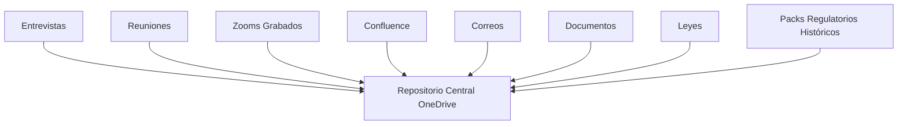
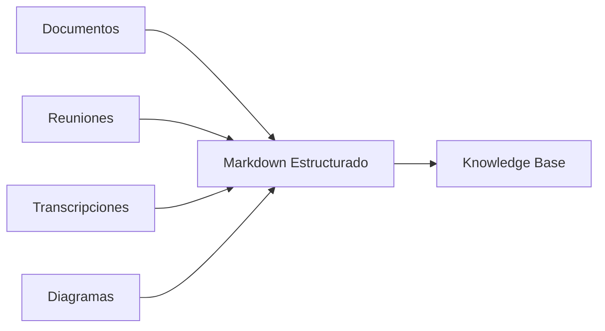
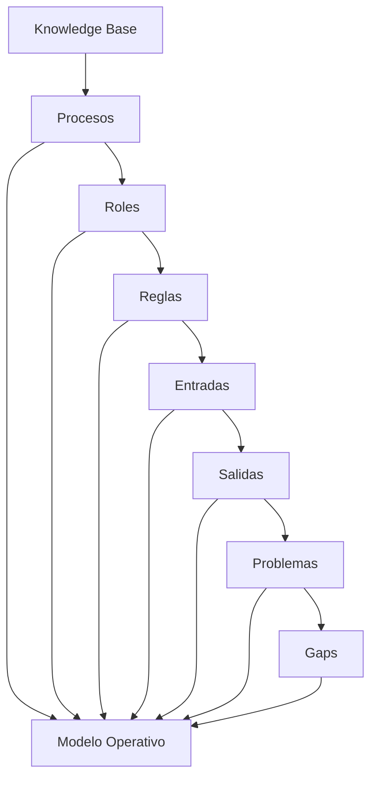

# Regulatory Knowledge Base Initiative (RKB)
## Guía de Trabajo para Montserrat y Lucía
### Fase 1 – Descubrimiento, Recolección y Estructuración del Conocimiento

---

# 1. Introducción

## ¿Por qué estamos haciendo esto?

Durante los últimos años se han realizado diversos esfuerzos para construir y evolucionar el sistema relacionado con el Pack Regulatorio.

Sin embargo, después de múltiples sesiones, proveedores, documentos y desarrollos, hemos identificado un problema fundamental:

> No existe una definición clara, completa y consensuada de cómo funciona realmente el proceso de negocio ni de cuál debería ser el comportamiento esperado del sistema.

Esto provoca que:

- Cada participante tenga una interpretación diferente.
- Los requerimientos cambien constantemente.
- Los proveedores reciban información incompleta.
- Se generen funcionalidades que no satisfacen las expectativas.
- Se dificulte evaluar objetivamente el avance del proyecto.

Por esta razón, antes de diseñar nuevas funcionalidades o construir nuevas soluciones, necesitamos comprender completamente el dominio del problema.

---

# 2. Objetivo de esta Fase

El objetivo NO es construir una solución.

El objetivo NO es diseñar pantallas.

El objetivo NO es definir tecnologías.

El objetivo NO es generar nuevos desarrollos.

## El objetivo real

Construir una Base de Conocimiento Regulatoria que concentre todo el conocimiento disponible del proyecto.

Adicionalmente, esta fase busca preparar la información para que posteriormente pueda utilizarse un proceso de generación asistida por IA basado en el template de SPECS que actualmente utiliza el equipo y que ya ha demostrado ser efectivo en iniciativas previas.

La intención no es reinventar la forma de documentar requerimientos, sino aprovechar el conocimiento acumulado y nutrir a la IA con nuestra estructura actual de SPECS para acelerar la construcción de Functional Designs, Pre-SPECS y SPECS formales.

Esta base de conocimiento servirá posteriormente para:

- Diseño funcional.
- Diseño UX.
- Diseño técnico.
- Generación de SPECS.
- Generación de Mockups.
- Diseño de Arquitectura.
- Evaluación con Inteligencia Artificial.
- Entrenamiento de nuevos integrantes.
- Transferencia de conocimiento.
- Elaboración de RFPs.
- Entrega a proveedores.
- Preparación de paquetes para proveedores.
- Elaboración de RFPs.
- Transferencia estructurada de conocimiento.
- Alineación entre negocio, arquitectura e ingeniería.
- Definición formal de alcance para terceros.

## Resultado Estratégico

El objetivo final de esta iniciativa no es que el equipo construya directamente una solución tecnológica.

El objetivo es generar suficiente conocimiento estructurado y validado para poder entregar a proveedores externos un paquete claro, completo y consistente que les permita entender el dominio del problema y proponer una solución adecuada.

Este material deberá poder ser utilizado por proveedores como:

- Hexaware
- Amaris
- T-Systems
- Otros proveedores potenciales

La calidad de esta base de conocimiento impactará directamente la calidad de las propuestas, estimaciones y desarrollos que recibamos posteriormente.

---

# 3. Resultado Esperado

Al finalizar esta fase deberemos tener una única fuente de verdad.

Esta fuente deberá permitir responder preguntas como:

- ¿Qué es el Pack Regulatorio?
- ¿Cuál es el proceso actual?
- ¿Quién participa?
- ¿Qué documentos intervienen?
- ¿Qué regulaciones aplican?
- ¿Qué información se captura?
- ¿Qué información se genera?
- ¿Cuáles son los principales problemas?
- ¿Qué funcionalidades son realmente necesarias?
- ¿Qué debería hacer una futura solución?

---

# 4. Principio Fundamental

## Regla de Oro

Toda información obtenida debe terminar convertida en texto estructurado.

No importa si la información proviene de:

- Zoom
- Teams
- Confluence
- Correo
- Word
- PowerPoint
- PDF
- Diagramas
- Entrevistas
- Reuniones

Todo debe terminar convertido en texto organizado.

¿Por qué?

Porque el texto:

- Puede ser leído por personas.
- Puede ser leído por IA.
- Puede buscarse.
- Puede versionarse.
- Puede convertirse a Wiki.
- Puede convertirse a SPECS.
- Puede reutilizarse posteriormente.

---

# 5. Arquitectura de Recolección de Información



---

# 6. Organización Inicial del OneDrive

Crear una estructura similar a la siguiente:

```text
Regulatory-Knowledge-Base/

├── 01_Entrevistas
├── 02_Grabaciones
├── 03_Transcripciones
├── 04_Confluence
├── 05_Documentacion_Actual
├── 06_Leyes_y_Regulacion
├── 07_Packs_Ejemplo
├── 08_Diagramas
├── 09_Procesos
├── 10_Markdown
├── 11_Hallazgos
├── 12_Preguntas_Abiertas
```

---

# 7. Conversión de Información

Todo el contenido deberá transformarse progresivamente a Markdown.



---

# 8. Uso de Inteligencia Artificial

La Inteligencia Artificial NO será utilizada para inventar requerimientos.

Será utilizada para:

- Resumir.
- Organizar.
- Clasificar.
- Encontrar inconsistencias.
- Identificar vacíos.
- Generar preguntas.
- Detectar contradicciones.
- Sugerir modelos operativos.

Adicionalmente, se contempla el uso de herramientas como GitHub Copilot y otros asistentes de IA para acelerar el análisis documental, la generación de resúmenes, la identificación de inconsistencias y la construcción progresiva de la Knowledge Base.

La IA también deberá apoyarse en los templates y formatos de SPECS ya utilizados por el equipo.

Como parte de esta iniciativa será necesario incorporar dichos templates dentro de la Knowledge Base para que puedan utilizarse como referencia durante la generación de:

- Functional Designs.
- Pre-SPECS.
- SPECS formales.
- Diagramas.
- Reglas de negocio.
- Historias funcionales.

El objetivo es maximizar la reutilización de conocimiento y mantener consistencia entre proyectos.

---

# 8.1 Guía Práctica para Lucía y Montserrat

Lucía, Montserrat,

Uno de los objetivos más importantes de esta fase es transformar información dispersa en conocimiento estructurado y reutilizable.

Para lograrlo, les pedimos que utilicen las herramientas disponibles como:

- Productivity Suite.
- GitHub Copilot.
- ChatGPT (Externo) - Dictarle y convertir conocmiento en documentos accionables.
- O cualquier otra herramienta a su alcance.

## ¿Qué esperamos obtener?

La expectativa es que la mayor parte de la información termine convertida a Markdown estructurado.

No buscamos almacenar únicamente documentos originales.

Buscamos generar conocimiento procesado, organizado y enriquecido que pueda ser consumido posteriormente por personas, equipos de proyecto e Inteligencia Artificial.

## ¿Qué es Markdown?

Markdown es un formato de texto simple utilizado ampliamente para documentación técnica, Knowledge Bases, Wikis y proyectos de software.

Su principal ventaja es que:

- Es fácil de leer.
- Es fácil de editar.
- Funciona muy bien con Inteligencia Artificial.
- Permite búsquedas eficientes.
- Puede convertirse posteriormente a Wiki, HTML, PDF o documentación formal.

Ejemplo:

```markdown
# Proceso de Validación

## Participantes

- Negocio
- Operaciones
- Compliance

## Flujo

1. Recepción.
2. Validación.
3. Aprobación.
4. Cierre.
```

## Forma Recomendada de Trabajo

Para cada documento, reunión, grabación o fuente de información:

### Paso 1

Capturar la información original.

### Paso 2

Utilizar IA para:

- Resumir contenido.
- Identificar conceptos clave.
- Extraer decisiones.
- Identificar actores.
- Identificar reglas de negocio.
- Detectar preguntas abiertas.

### Paso 3

Convertir el resultado a Markdown estructurado.

### Paso 4

Mejorar la redacción utilizando IA.

### Paso 5

Guardar el resultado dentro de la estructura definida para la Knowledge Base.

## Calidad Esperada

Nos gustaría que cada documento generado:

- Esté bien redactado.
- Sea fácil de leer.
- Explique claramente el contexto.
- Identifique participantes.
- Documente decisiones.
- Incluya preguntas abiertas cuando existan.
- Sea entendible para alguien que nunca participó en la sesión.

## Regla Importante

No se trata únicamente de almacenar información.

Se trata de transformar conocimiento tácito en conocimiento explícito.

Cada documento que procesemos debería quedar mejor organizado, mejor explicado y más útil que la fuente original.

La Inteligencia Artificial debe utilizarse como un acelerador para ayudarnos a construir una Knowledge Base de alta calidad que posteriormente sirva para análisis, diseño funcional, generación de SPECS y preparación de paquetes para proveedores.

---

# 9. Proceso de Trabajo

## Paso 1

Recolectar toda la información existente.

## Paso 2

Clasificarla dentro del repositorio.

## Paso 3

Convertirla a texto estructurado.

## Paso 4

Validar que el contenido sea entendible.

## Paso 5

Generar conocimiento consolidado.

## Paso 6

Analizar con IA.

## Paso 7

Identificar vacíos.

## Paso 8

Realizar nuevas entrevistas.

## Paso 9

Actualizar conocimiento.

## Paso 10

Repetir el ciclo.

---

# 10. Qué Queremos Obtener de la IA



---

# 11. Lo que NO Debemos Hacer

❌ Diseñar pantallas demasiado pronto.

❌ Discutir tecnologías antes de entender el proceso.

❌ Crear requerimientos basados en supuestos.

❌ Asumir que todos entienden lo mismo.

❌ Construir funcionalidades sin validación.

❌ Saltar directamente a desarrollo.

---

# 12. Fases Futuras

```mermaid
flowchart LR

KD[Knowledge Discovery]
--> KS[Knowledge Structuring]
--> KV[Knowledge Validation]
--> AI[AI Assisted Analysis]
--> WR[Collaborative Design Workshop]
--> FD[Functional Design]
--> SPEC[Specification Package]
--> RFP[Vendor Package / RFP]
--> ALIGN[Vendor Alignment]
--> DEV[Development]
--> TEST[Testing]
--> PROD[Production]
```



## Descripción de las Fases

### Knowledge Discovery

Recolectar y centralizar conocimiento.

### Knowledge Structuring

Convertir información dispersa en conocimiento organizado.

### Knowledge Validation

Validar que el conocimiento represente correctamente el proceso real.

### AI Assisted Analysis

Utilizar IA para identificar inconsistencias, vacíos y oportunidades de mejora.

### Collaborative Design Workshop

Una vez consolidada y validada la Knowledge Base, se realizará una fase intensiva de trabajo colaborativo.

El objetivo será reunir en sesiones tipo War Room a los principales participantes del proyecto para utilizar la información consolidada como base de análisis y diseño.

Participantes sugeridos:

- Lucía Barraso
- Montserrat
- Daniel Pachón
- Virgilio Patiño
- Cuauhtémoc Morales
- Liliana García
- Agustín Pérez
- Equipo de Ingeniería
- Especialistas adicionales según sea necesario

Durante estas sesiones se utilizarán herramientas de Inteligencia Artificial para:

- Analizar el conocimiento consolidado.
- Resolver diferencias de interpretación.
- Identificar procesos faltantes.
- Detectar inconsistencias.
- Generar propuestas funcionales.
- Elaborar diagramas de proceso.
- Generar alternativas de solución.
- Construir borradores de Functional Design.
- Generar primeros sketches conceptuales.

La expectativa es dedicar una o varias sesiones intensivas de trabajo para acelerar la definición funcional antes de pasar a la generación formal de SPECS.

### Functional Design

Construir la definición funcional del proceso y de la solución esperada.

Durante esta fase se espera que la IA utilice tanto la Knowledge Base consolidada como los templates de SPECS existentes para proponer estructuras funcionales alineadas a los estándares ya adoptados por el equipo.

### Specification Package

Generar SPECS, procesos, reglas de negocio, diagramas y documentación formal.

### Vendor Package / RFP

Preparar un paquete de información que permita a proveedores entender claramente el alcance y estimar adecuadamente la solución.

### Vendor Alignment

Sesiones de aclaración, transferencia de conocimiento y validación de entendimiento con los proveedores seleccionados.

### Development / Testing / Production

Etapas ejecutadas por el proveedor seleccionado siguiendo el marco de gobierno definido por el proyecto.

---

# Referencias y Frameworks Recomendados

El objetivo de esta iniciativa no es únicamente recopilar información. También buscamos apoyarnos en prácticas ampliamente utilizadas para análisis, diseño y descubrimiento de soluciones.

Los participantes pueden utilizar Inteligencia Artificial para obtener resúmenes, ejemplos y mejores prácticas relacionadas con los siguientes temas.

## Diseño y Descubrimiento

- Design Thinking.
- Service Design.
- Event Storming.
- Customer Journey Mapping.
- Process Discovery.

## Diseño Funcional y Arquitectura

- Domain Driven Design (DDD).
- Bounded Contexts.
- Functional Design.
- Business Capability Mapping.
- Value Stream Mapping.

## Definición de Requerimientos

- Spec Driven Design.
- Specification by Example.
- User Story Mapping.
- Behavior Driven Development (BDD).
- Requirements Engineering.

## Inteligencia Artificial Aplicada

- Retrieval Augmented Generation (RAG).
- Knowledge Bases.
- Prompt Engineering.
- AI Assisted Analysis.
- AI Assisted Design.

## Objetivo de estas Referencias

No buscamos aplicar cada framework de forma estricta.

Buscamos aprovechar sus principios para mejorar la calidad del análisis, la colaboración entre equipos y la construcción de una definición funcional sólida.

---

# Objetivo de la Semana

Fecha objetivo inicial: Viernes de esta semana.

Para esta primera iteración se espera lograr:

- Crear la estructura base del repositorio en OneDrive.
- Identificar y recopilar las principales fuentes de información.
- Iniciar la conversión de conocimiento a Markdown.
- Consolidar los primeros documentos relevantes.
- Definir el enfoque de organización de la Knowledge Base.
- Identificar el template de SPECS que servirá como estándar de referencia.
- Preparar el terreno para el análisis asistido por IA.

El objetivo no es terminar toda la iniciativa esta semana, sino establecer una base sólida que permita acelerar las siguientes fases.

---

# 14. Checklist de Avance

## Recolección

- [ ] Todas las grabaciones identificadas.
- [ ] Todos los documentos recopilados.
- [ ] Todas las fuentes localizadas.
- [ ] Repositorio OneDrive creado.

## Organización

- [ ] Carpetas creadas.
- [ ] Documentos clasificados.
- [ ] Duplicados identificados.

## Conversión

- [ ] Transcripciones generadas.
- [ ] Documentos convertidos a Markdown.
- [ ] Diagramas documentados.

## Consolidación

- [ ] Conocimiento unificado.
- [ ] Preguntas abiertas identificadas.
- [ ] Inconsistencias detectadas.

## IA

- [ ] Análisis ejecutado.
- [ ] Gaps identificados.
- [ ] Recomendaciones generadas.

---

# 15. Entregable Esperado

Al concluir esta fase deberá existir:

1. Un repositorio organizado.
2. Una base de conocimiento consolidada.
3. Un conjunto de documentos en Markdown.
4. Un inventario de preguntas abiertas.
5. Un análisis inicial generado con IA.
6. Un entendimiento común del dominio.
7. Un Functional Design inicial.
8. Un conjunto de propuestas funcionales generadas colaborativamente.
9. Resultados de sesiones de diseño asistidas por IA.
10. Un paquete preliminar de SPECS o Pre-SPECS.
11. Un Vendor Package listo para compartir con proveedores.
12. Material suficiente para iniciar procesos de RFP, estimación y evaluación de soluciones.

Solamente después de completar estos pasos podremos avanzar con seguridad hacia diseño funcional detallado, especificaciones formales, preparación de paquetes para proveedores y eventualmente la construcción de una nueva solución mediante el proveedor seleccionado.
